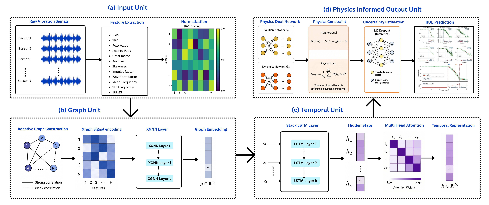

# PI-XGNN

**Adaptive Physics-Informed Explainable Graph Neural Network for Probabilistic Remaining Useful Life Prediction of Wind Turbine Gearbox**

<div align="center">

[](https://www.python.org/)
[](https://pytorch.org/)
[](LICENSE)
[](.)
[](.)
[](https://developer.nvidia.com/cuda-toolkit)
[](.)

</div>

---

## Table of Contents

- [Overview](#overview)
- [Architecture](#architecture)
- [Dataset Information](#dataset-information)
- [Project Structure](#project-structure)
- [Installation & Environment Setup](#installation--environment-setup)
- [Training Configuration](#training-configuration)
- [Usage](#usage)
- [Results](#results)
- [Citation](#citation)

---

## Overview

PI-XGNN addresses four systematic gaps that exist in prior bearing RUL literature by jointly integrating:

| Capability                          | Description                                                                                                                        |
| ----------------------------------- | ---------------------------------------------------------------------------------------------------------------------------------- |
| **Adaptive Graph Encoding**         | Learnable adjacency threshold τ evolves with bearing health state — sparse in healthy, dense in degraded                           |
| **Calibrated Probabilistic Output** | MC Dropout produces 95 % prediction intervals anchored to a training-set nominal coverage target                                   |
| **Graph-Native Explainability**     | Gradient-based node importance reveals which sensor features drive the RUL at each degradation stage                               |
| **Real Wind Turbine Validation**    | Zero-shot evaluated on the NREL GRC dynamometer dataset — the first such cross-domain evaluation for a physics-informed RUL method |

The model combines three inductive biases:

1. **Spatial** — adaptive sensor-correlation graph
2. **Temporal** — stacked LSTM + multi-head attention
3. **Physical** — PDE-based monotonic decay constraint

---

## Architecture

<p align="center">
  
</p>


The model combines three inductive biases:

1. **Spatial** — adaptive sensor-correlation graph
2. **Temporal** — stacked LSTM + multi-head attention
3. **Physical** — PDE-based monotonic decay constraint

---

## Dataset Information

### XJTU-SY (Primary Benchmark)

| Property      | Value                                                                                              |
| ------------- | -------------------------------------------------------------------------------------------------- |
| Bearings      | 15 (5 per condition)                                                                               |
| Conditions    | 3 (35/37.5/40 Hz, 12/11/10 kN)                                                                     |
| Sampling rate | 25.6 kHz                                                                                           |
| Split         | Bearings 1–4 → train, Bearing 5 → test                                                             |
| **Download**  | [https://biaowang.tech/xjtu-sy-bearing-datasets/](https://biaowang.tech/xjtu-sy-bearing-datasets/) |

### PHM 2012 / PRONOSTIA (Cross-Dataset)

| Property      | Value                                                                                                                                                                                                          |
| ------------- | -------------------------------------------------------------------------------------------------------------------------------------------------------------------------------------------------------------- |
| Bearings      | 17 (3 conditions)                                                                                                                                                                                              |
| Sampling rate | 25.6 kHz                                                                                                                                                                                                       |
| **Download**  | [https://www.femto-st.fr/en/Research-departments/AS2M/Research-groups/PHM/IEEE-PHM-2012-Data-challenge](https://www.femto-st.fr/en/Research-departments/AS2M/Research-groups/PHM/IEEE-PHM-2012-Data-challenge) |

### NREL GRC (Wind Turbine Validation)

| Property       | Value                                                                    |
| -------------- | ------------------------------------------------------------------------ |
| Type           | 750 kW 3-stage wind turbine dynamometer                                  |
| Configurations | Healthy & Damaged                                                        |
| **Download**   | [https://www.nrel.gov/wind/grc.html](https://www.nrel.gov/wind/grc.html) |

**Expected data directory layout (XJTU-SY):**

```
data/XJTU-SY/
├── Bearing1_1/
│   ├── acc_00001.mat
│   └── ...
├── Bearing1_2/ ...
├── Bearing2_1/ ...
└── Bearing3_5/
```

---

## Project Structure

```
pi_xgnn/
├── config.py                    # All hyperparameters in one dataclass
│
├── datasets/
│   ├── preprocess.py            # 12-feature extraction + IRRMS + RUL labels
│   ├── xjtu_sy.py               # XJTU-SY .mat loader
│   ├── phm2012.py               # PHM 2012 / PRONOSTIA loader
│   ├── nrel_grc.py              # NREL GRC loader
│   ├── bearing_dataset.py       # PyTorch Dataset + DataLoader builder
│   └── synthetic.py             # Synthetic bearing generator (demo / CI)
│
├── models/
│   ├── graph_encoder.py         # AdaptiveGraphEncoder  (STE threshold τ)
│   ├── temporal_encoder.py      # TemporalEncoder       (LSTM + Attention)
│   ├── physics_net.py           # SolutionNet F  &  DynamicsNet G
│   └── pi_xgnn.py               # PIXGNN — full model + MC Dropout + explainability
│
├── engine/
│   ├── losses.py                # pi_loss  (data + PDE + monotonicity)
│   ├── trainer.py               # train_one_seed / train_with_seeds
│   └── evaluator.py             # MC Dropout inference + z* calibration
│
├── utils/
│   ├── metrics.py               # RMSE, MAE, R², PICP, MPIW
│   └── visualization.py         # RUL plot + feature importance bar chart
│
├── eda/                         # Exploratory analysis and result visualisation
│   ├── data_eda.py
│   ├── cross_domain.py
│   ├── result_plots.py
│   ├── tables.py
│   ├── training_viz.py
│   └── run_all.py
│
├── train.py                     # Main training entry point
├── train_baselines.py            # Baseline model training entry point
├── evaluate.py                  # Evaluation of a saved checkpoint
├── demo.py                      # Synthetic-data demo (no dataset needed)
└── requirements.txt
```

---

## Installation & Environment Setup

### 1. Clone the repository

```bash
git clone https://github.com/uzzal2200/pi-xgnn-wind-turbine-rul.git
cd pi-xgnn
```

### 2. Create and activate a Conda environment

Install [Miniconda](https://docs.conda.io/projects/miniconda/en/latest/) or
[Anaconda](https://www.anaconda.com/download) if Conda is not already available.

```bash
conda create -n pi-xgnn python=3.9 -y
conda activate pi-xgnn
```

On Windows PowerShell, the same commands are used after opening an Anaconda
Prompt or after enabling Conda integration for PowerShell.

### 3. Install dependencies

```bash
python -m pip install --upgrade pip
pip install -r requirements.txt
```

> **GPU (recommended):** Install the CUDA-enabled PyTorch wheel from [pytorch.org](https://pytorch.org/get-started/locally/) before installing the remaining dependencies if GPU acceleration is required. The configuration automatically selects CUDA when it is available.

### 4. Verify the environment

```bash
python -c "import torch; print('PyTorch:', torch.__version__); print('CUDA available:', torch.cuda.is_available())"
```

### 5. Run the synthetic demo

```bash
python demo.py --epochs 10 --seeds 1
```

Expected output ends with a metrics table — no dataset required.

---

## Training Configuration

All hyperparameters live in `config.py` and can be overridden via CLI flags.

| Parameter         | Default | Description                             |
| ----------------- | ------- | --------------------------------------- |
| `window_length`   | 5       | Sliding-window size L                   |
| `latent_dim`      | 8       | Degradation state code dimension        |
| `n_heads`         | 4       | Attention heads                         |
| `dropout`         | 0.20    | MC Dropout probability                  |
| `lambda_pde`      | 0.15    | PDE residual loss weight                |
| `lambda_mono`     | 0.15    | Monotonicity loss weight                |
| `epochs`          | 200     | Training epochs per seed                |
| `n_seeds`         | 3       | Independent runs (best train loss kept) |
| `batch_size`      | 64      | Mini-batch size                         |
| `lr`              | 1e-3    | AdamW learning rate                     |
| `weight_decay`    | 1e-4    | AdamW weight decay                      |
| `grad_clip`       | 1.0     | Gradient clipping norm                  |
| `mc_samples`      | 100     | MC Dropout forward passes at inference  |
| `alpha_aleatoric` | 0.10    | Aleatoric noise floor multiplier        |
| `coverage_target` | 0.95    | Nominal PICP target for z\* calibration |

---

## Usage

### Quick demo (no dataset needed)

```bash
python demo.py                        # 80 epochs, 1 seed
python demo.py --epochs 200 --seeds 3 --plot
```

### Train on XJTU-SY

```bash
python train.py \
    --data_dir ./data/XJTU-SY \
    --condition 1 \
    --epochs 200 \
    --seeds 3 \
    --plot \
    --save pi_xgnn_C1.pt
```

Run all three conditions:

```bash
for cond in 1 2 3; do
    python train.py --condition $cond --save pi_xgnn_C${cond}.pt
done
```

### Evaluate a saved checkpoint

```bash
python evaluate.py --checkpoint pi_xgnn_C1.pt --plot
```

This saves:

- `rul_C1_eval.png` — prediction + 95 % CI plot
- `feature_importance.png` — gradient-based attribution bar chart

---

## Results

### XJTU-SY — Main comparison (test bearing 5 per condition)

| Method      | C1 RMSE ↓  | C1 R² ↑   | C1 PICP ↑ | C2 RMSE ↓  | C3 RMSE ↓  |
| ----------- | ---------- | --------- | --------- | ---------- | ---------- |
| MLP         | 0.1823     | 0.692     | 0.731     | 0.2287     | 0.3249     |
| LSTM        | 0.1412     | 0.815     | 0.808     | 0.1771     | 0.2516     |
| CNN-BiLSTM  | 0.1247     | 0.856     | 0.846     | 0.1564     | 0.2222     |
| AttnPINN    | 0.1089     | 0.890     | 0.877     | 0.1366     | 0.1941     |
| PI-TENN     | 0.0898     | 0.925     | 0.923     | 0.1126     | 0.1600     |
| **PI-XGNN** | **0.0468** | **0.980** | **0.979** | **0.0587** | **0.0834** |

### PHM 2012 — Cross-dataset generalisation

| Setup                         | PHM-C1 RMSE | PHM-C2 RMSE | PHM-C3 RMSE |
| ----------------------------- | ----------- | ----------- | ----------- |
| Zero-shot                     | 0.3947      | 0.5234      | 0.3012      |
| Fine-tuned (2 decoder layers) | **0.0361**  | **0.1020**  | **0.0758**  |

### NREL GRC — Domain validation (latent-space separation)

| Variant         | t-SNE Silhouette ↑ | UMAP Silhouette ↑ |
| --------------- | ------------------ | ----------------- |
| PI-XGNN (Full)  | **0.391**          | **0.907**         |
| No-PDE ablation | 0.013              | −0.002            |

### Ablation (Condition 1)

| Variant              | RMSE       | ΔRMSE   |
| -------------------- | ---------- | ------- |
| No-Graph (= PI-TENN) | 0.0898     | +91.9 % |
| No-Physics           | 0.0568     | +21.4 % |
| No-PDE               | 0.0562     | +20.1 % |
| **PI-XGNN (Full)**   | **0.0468** | —       |

---

## Citation

If you use this code or build upon this work, please cite:

```bibtex
@article{mia2026pixgnn,
  title   = {Adaptive Physics-Informed Explainable Graph Neural Network
             for Probabilistic Remaining Useful Life Prediction of
             Wind Turbine Gearbox},
  author  = {Mia, Md. Uzzal and Debnath, Sajib},
  journal = {IEEE Access},
  year    = {2026},
  doi     = {10.1109/ACCESS.2024.0429000}
}
```

---

## License

This project is released under the [MIT License](LICENSE).

---

<p align="center">
Made with ❤️ for open reproducible research in wind energy prognostics
</p>
